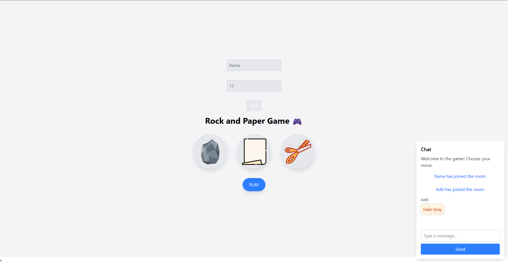

# Rock Paper Scissors Online

A real-time multiplayer Rock Paper Scissors game built with Node.js, Express, and Socket.IO. Challenge your friends or other players in classic duels!



## ✨ Features

-   **Real-time Multiplayer:** Play against others instantly.
-   **Room-based System:** Create or join game rooms using a Room ID.
-   **Player vs. Player:** Supports two players per room for a head-to-head match.
-   **Classic Choices:** Rock, Paper, or Scissors – the timeless game of wits!
-   **Instant Feedback:** See results (Win, Lose, or Draw) immediately after both players choose.
-   **In-game Chat:** Communicate with your opponent during the game.
-   **Typing Indicator:** See when your opponent is typing a message.
-   **Simple UI:** Easy-to-understand interface for a smooth gaming experience.

## 🛠️ Tech Stack

-   **Backend:** Node.js, Express.js
-   **Real-time Communication:** Socket.IO
-   **Frontend:** HTML, CSS, JavaScript (served via Express static files from the `public` directory)

## 🚀 Getting Started

Follow these instructions to get a copy of the project up and running on your local machine for development and testing purposes.

### Prerequisites

-   Node.js (v14.x or later recommended)
-   npm (comes bundled with Node.js)

### Installation

1.  **Clone the repository:**
    ```bash
    git clone https://github.com/rama4zis/rock-paper-scissors.git
    cd rock-paper-scissors
    ```

2.  **Install dependencies:**
    This project uses Express and Socket.IO.
    ```bash
    npm install express socket.io
    ```
    (If you have a `package.json` file, you can simply run `npm install`)

### Running the Application

1.  **Start the server:**
    ```bash
    node index.js
    ```
    For development, you might prefer using `nodemon` for automatic server restarts on file changes:
    ```bash
    nodemon index.js
    ```

2.  **Open in your browser:**
    Navigate to `http://localhost:3000`.

## 🎮 How to Play

1.  **Enter Details:**
    *   Open the game in two separate browser tabs or on two different devices.
    *   On the main page, each player should enter a **Username** and a common **Room ID**.
    *   If the Room ID doesn't exist, a new room will be created.
    *   If the Room ID exists and has fewer than two players, the player will join it.
    *   Rooms are limited to a maximum of two players. If a third player tries to join, they will be notified that the room is full.

2.  **Wait for Opponent:**
    *   If you're the first in the room, wait for another player to join using the same Room ID.
    *   Players will receive a notification when another player joins the room.

3.  **Make Your Choice:**
    *   Once two players are in the room, the game can begin!
    *   Each player secretly selects Rock, Paper, or Scissors.
    *   Players will be notified when their opponent has made a choice (but not what they chose!).

4.  **See the Result:**
    *   After both players have made their choices, the game server determines the winner.
    *   The result (e.g., "Player 1 Wins!", "It's a Draw!") will be displayed to both players in a modal.

5.  **Chat with Your Opponent:**
    *   Use the chatbox to send messages to your opponent during the game.
    *   A typing indicator will show when the other player is typing.

6.  **Play Again:**
    *   After the result is shown, player choices are reset, and you can play another round in the same room.
